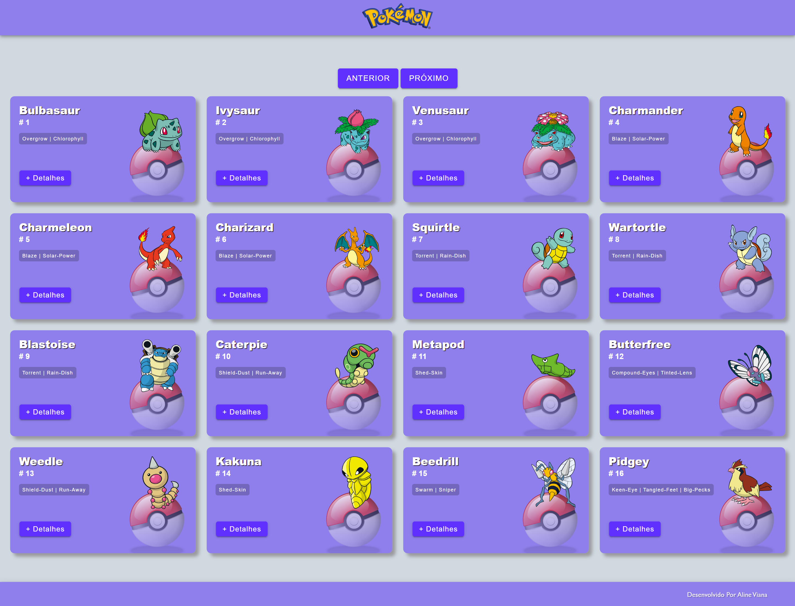
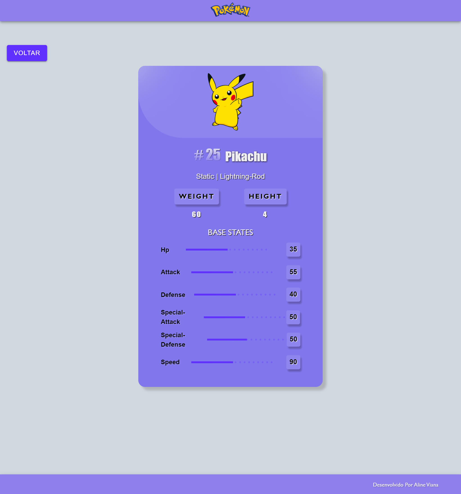

# Projeto Pokémon com Ionic e Angular

Projeto desenvolvido utilizando a API RESTful da PokeAPI para criar um pequeno aplicativo que permite aos usuários explorar e interagir com informações de Pokémons.

 



## 🛠️ Funcionalidades

- Tela Principal: Mostra cards com o nome, imagem, habilidades e id de vários Pokémons
- Redirecionamento: Leva o usuário para uma tela de detalhes do Pokémon selecionado
- Detalhes do Pokémon: Exibe uma lista com imagem do Pokémon, Peso, Altura, Hp, Attack, Defense, Special-Attack, Special-Defense e Speed
- Compartilhamento: O projeto é compartilhado via GitHub seguindo boas práticas de código e commits
- Responsividade: A interface do usuário é adaptada para mudanças de tamanho de tela.

## 🖥️ Tecnologias
- Ionic 
- Angular

## 📖 Guia de instalação

Abra o terminal e digite:

```sh
git clone https://github.com/alineviana/ionic-angular.git
```

Instale todas as dependências para a aplicação rodar diretamente no localhost:

```sh
npm install
```

Com a aplicação clonada e todas as dependências instaladas você pode executar o comando abaixo para iniciar a aplicação:

```sh
npx ionic serve
```

A aplicação rodará no endereço http://localhost:8100/ 

<br>

## 👩‍💻 Author

<table align="left">
    <tr align="left">
        <td>
            <a href="https://github.com/alineviana">
                
                <p>👩🏽‍💻 Aline Viana</p> 
            </a>
        </td>
    </tr> 
</table>